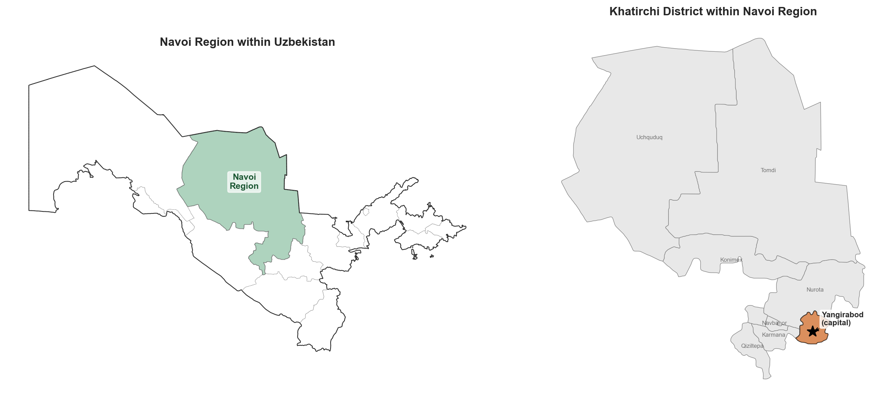
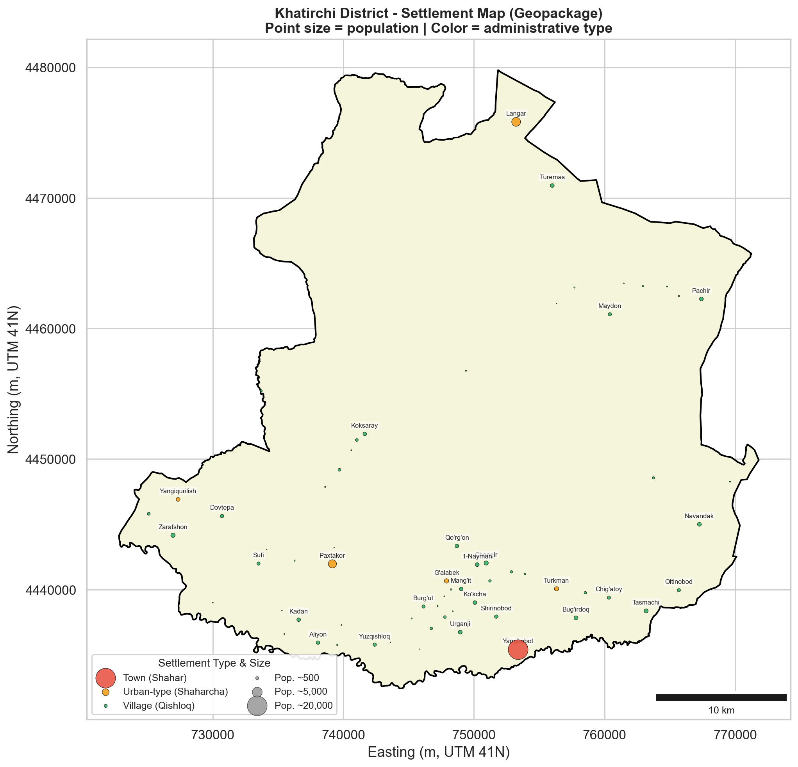
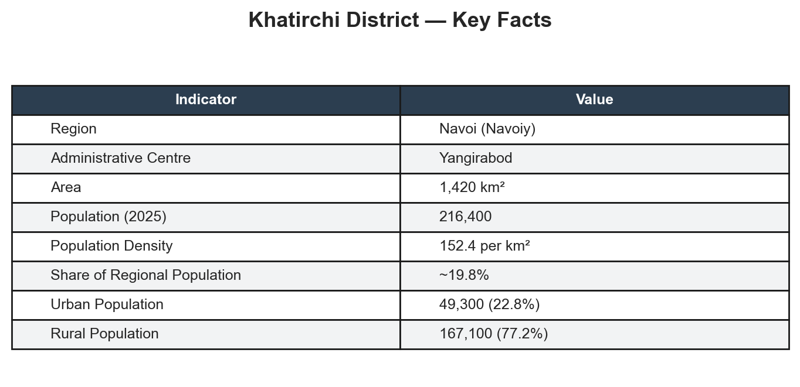
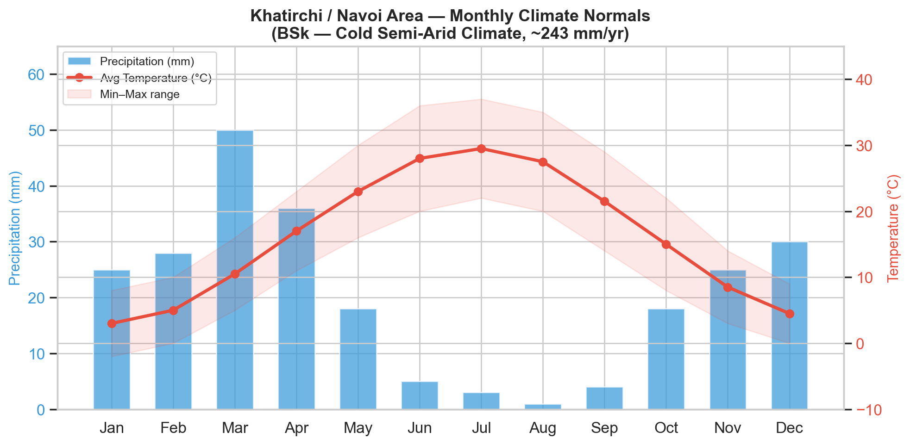
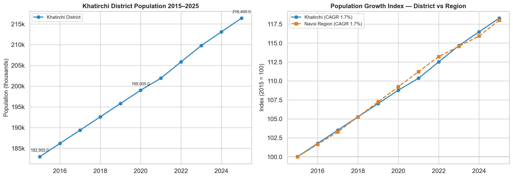
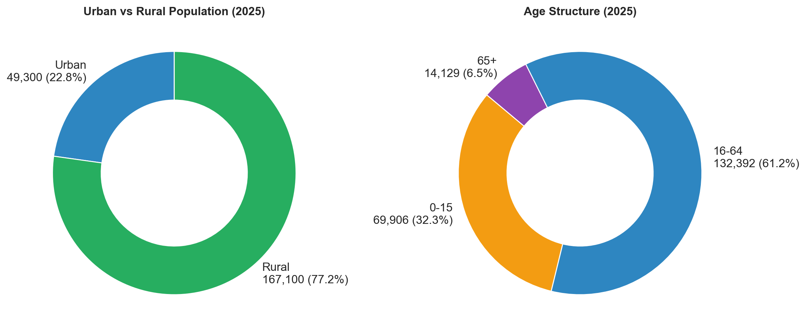
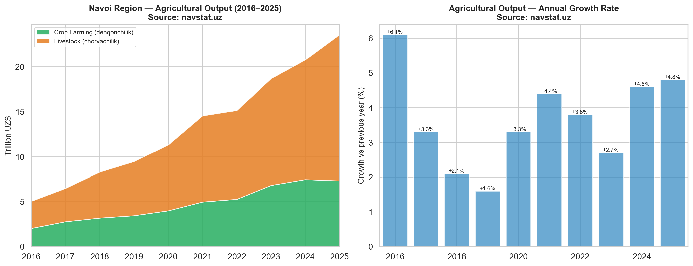
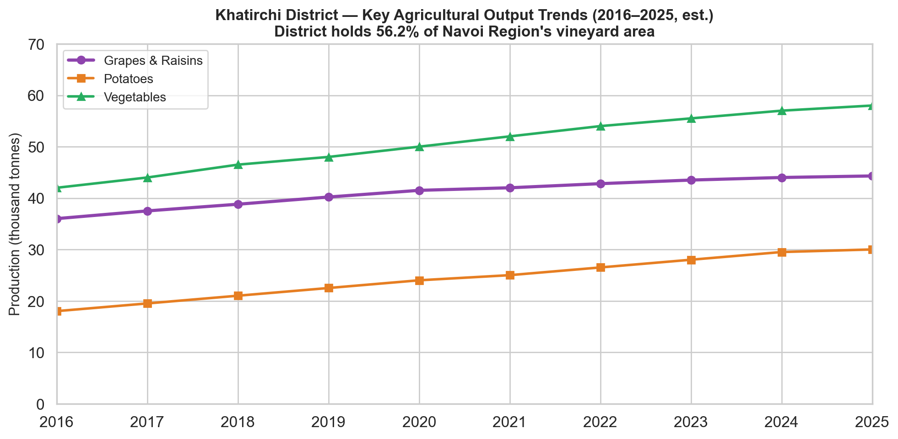

# Khatirchi District Profile — Data Analysis Notebook

District profiling assignment for **Khatirchi District (Xatirchi Tumani), Navoi Region, Uzbekistan**.

## Structure

```
├── main.ipynb                        # Main jupyter notebook — analysis & visualizations
├── Khatirchi_District_Profile.docx   # Final report (narrative + figures)
├── requirements.txt                  # Python dependencies
├── data/                             # Source data (CSVs + GADM GeoJSON)
│   ├── population_khatirchi.csv
│   ├── population_navoi.csv
│   ├── climate_normals.csv
│   ├── economy_navoi.csv
│   ├── age_structure.csv
│   └── gadm41_UZB_*.json
├── geopackage/                       # District data (for the task purposes)
│   ├── Xatirchi_boundary.gpkg
│   └── Xatirchi_points.gpkg
└── outputs/                          # Generated charts and maps
```

## Setup

Requires Python 3.12 (managed via pyenv) and a virtual environment:

```bash
pyenv install 3.12
python -m venv venv
source venv/bin/activate
pip install -r requirements.txt
```

## Running

Open `main.ipynb` in Jupyter or VS Code and run all cells. The first run downloads
GADM administrative boundaries (~370 KB) from `geodata.ucdavis.edu`.

All figures are saved to `outputs/` for insertion into the docx report.

## Data Sources

| Data | Source |
|------|--------|
| Population & agriculture | [navstat.uz](https://www.navstat.uz/uz/rasmiy-statistika/demography-2) (Navoi Region Statistics Department) |
| Regional GRP | [stat.uz](https://stat.uz) (State Committee of Statistics) |
| Climate normals | [weather-and-climate.com](https://weather-and-climate.com/average-monthly-Rainfall-Temperature-Sunshine,navoi-uz,Uzbekistan) |
| Administrative boundaries | [GADM v4.1](https://gadm.org/) |
| District boundary & settlements | Official geopackage (provided by task organisers) |
| Policy / decrees | [lex.uz](https://lex.uz), [president.uz](https://president.uz) |
| Viticulture study | ZIENJOURNALS — Deepening of Territorial Specialization in Production |

---

# District Profile: Khatirchi District (Xatirchi Tumani), Navoi Region

**Author:** Toshniyozov Murtazo
**Date:** April 2026

## 1. General Note on District Location and Settlements

Khatirchi District (Xatirchi Tumani) is situated in the southeastern part of Navoi Region, Republic of Uzbekistan. The size of district is 1420 km² and located in the Zarafshan River valley. Bordered by Nuratau Mountain range to the north and Kyzylkum Desert to the south.

The administrative centre of the district is the city of Yangirabod (population 23,000 as of 2025 app.ly). The district consists of 1 city (Yangirabod), 11 urban-type settlements (shaharchas) — including Langar, Jaloyir, Qo'shchinor, Polvontepa, Qo'rg'on, Tasmachi, Bog'ishamol, G'alabek, Paxtakor, Turkman, and Yangi qurilish — and 9 rural communities (qishloqs). As of 2025, the district's total population is estimated at 216,400, making it the most populous district in Navoi Region.

Transport connectivity is provided by regional roads linking Yangirabod to the city of Navoi (the regional capital) and to neighbouring district centres. The Zarafshan River serves as both an irrigation lifeline and a natural geographic axis along which the majority of settlements are concentrated.



*Figure 1. Location of Khatirchi District within Uzbekistan and Navoi Region*



*Figure 2. Administrative map of Khatirchi District with settlements (Source: Official geopackage data)*

## 2. Area Description in the Context of the Region and Uzbekistan

Khatirchi has a long agricultural history tied to the Zarafshan River irrigation systems. The area used to be part of the Bukhara oasis zone until Navoi Region was carved out as a separate administrative unit in 1982. District boundaries have stayed mostly the same since then.

Within Navoi Region, Khatirchi plays a unique role. The region itself is heavily industrial — gold, uranium, and chemicals around Navoi and Zarafshan cities — but Khatirchi is its main agricultural district. With about 216,400 people (roughly 20% of the region's 1.09 million), it is also the most populous. Viticulture and horticulture here complement the industrial activity elsewhere in the region.

Navoi Region contributed about 8.1% of national GDP in 2024 (117.3 trillion UZS). Khatirchi's share comes mostly from agriculture, though agro-processing and textiles are starting to grow.



*Table 1. Key facts about Khatirchi District (2025 est.)*

## 3. Environmental and Climate Note

Khatirchi District falls within the cold semi-arid climate zone, characterised by hot, dry summers and cold winters. Average temperatures range from approximately 3 °C in January to 29.5 °C in July, with summer daytime highs frequently reaching 37 °C and winter nights dropping to −2 °C. Annual precipitation is low, averaging around 243 mm, concentrated primarily in the spring months (March receives about 50 mm), while the summer months of July and August are essentially rainless (1–3 mm combined).

The district's landscape is divided into three distinct zones: (1) the irrigated Zarafshan River valley floor, supporting intensive agriculture including vineyards, orchards, and vegetable fields; (2) the semi-arid foothill zone of the Nuratau Mountains to the north, suitable for rain-fed viticulture and pasture; and (3) the desert-steppe margins extending towards the Kyzylkum Desert to the south and west. The Zarafshan River is the district's principal water source, feeding an extensive canal network. Key environmental pressures include water scarcity (exacerbated by upstream demand and climate change), soil salinisation from high evapotranspiration rates, and dust storms originating from the Kyzylkum Desert.



*Figure 3. Monthly climate normals — Khatirchi / Navoi area (Source: weather-and-climate.com)*

## 4. Analysis of Demography and Urbanization Trends

Khatirchi District has experienced steady population growth over the past decade, rising from roughly 183,000 in 2015 to an estimated 216,000 in 2025 — a compound annual growth rate (CAGR) of approximately 1.67%. This growth rate slightly exceeds that of Navoi Region as a whole (CAGR ~1.61%), reflecting the district's higher fertility rates typical of predominantly rural, agricultural populations.

The district remains overwhelmingly rural: as of 2025, approximately 167,100 residents (77.2%) live in rural areas, while 49,300 (22.8%) reside in urban settlements. This urban–rural ratio has remained relatively stable over the decade, with urbanisation proceeding slowly compared to Uzbekistan's national average (~50% urban). The concentration of population in rural communities reflects the district's agricultural economic base, which requires dispersed settlement across irrigated farmland.

The age structure of Khatirchi shows that the population is very young. As of 2025, 69,906 people (32.3% of the population) are between the ages of 0 and 15, 132,392 people (61.2%) are between the ages of 16 and 64, and only 14,129 people (6.5%) are 65 or older. The youth dependency ratio is 52.8%. There are almost as many men as women, with 50.7% men and 49.3% women.



*Figure 4. Population growth 2015–2025: Khatirchi District vs Navoi Region (Source: navstat.uz)*



*Figure 5. Urban/rural split and age structure, Khatirchi District (2025)*

## 5. Analysis of the District's Economy

Khatirchi's economy is built on agriculture, especially grapes and horticulture. The district holds 56.2% of Navoi Region's vineyard area and produces about 60.9% of the region's grape output. Other key crops include potatoes and vegetables, grown on irrigated land along the Zarafshan River.

According to navstat.uz, total agricultural output in Navoi Region grew from 5.0 trillion UZS in 2016 to 23.6 trillion UZS in 2025. Livestock (chorvachilik) has consistently outpaced crop farming (dehqonchilik) — by 2025 livestock made up about 69% of total agricultural output (16.3T vs 7.3T UZS). Year-on-year growth has stayed positive throughout the decade, ranging from +1.6% (2019) to +6.1% (2016).

The government is pushing diversification. Presidential Decree PP-430 (December 2024) designates Khatirchi for textile and horticulture development, with plans for an organic products lab, 500 hectares of new intensive gardens, and eco-tourism in villages like Sentob and Langar. Investors committed $566 million to mineral deposits across the region.



*Figure 6. Navoi Region GRP by sector and sectoral shares (2016–2025) (Source: stat.uz)*



*Figure 7. Khatirchi District — key agricultural output trends (2016–2025 est.) (Source: navstat.uz, ZIENJOURNALS)*

## 6. Analysis of Spatial Development Patterns

Water access and how people use farmland are closely linked to where people live in Khatirchi District. Most of the settlements are along the Zarafshan River valley and its network of irrigation canals in the western and central parts of the district. This is where fertile irrigated farmland supports both residential clusters and intensive agriculture. The district capital Yangirabod and most of the urban-type settlements are located in this corridor, which runs roughly east to west. This makes for a fairly dense settlement belt.

The southern and southwestern edges, on the other hand, are not very populated. They go into the dry steppe and the Kyzylkum Desert. The density of settlements is closely related to the irrigation infrastructure. In the irrigated zone, villages and shaharchas are usually 3 to 8 km apart, while in the arid margins, they are usually 15 km apart or more. This pattern shows how much the district depends on the Zarafshan River system and how easily the settlement network can be affected by water supply problems.

*(See Figure 2 above for the settlement distribution map.)*

## 7. Analysis of Climate Risks for the District and Its Economy

Khatirchi District's agriculture depends almost entirely on irrigation from the Zarafshan River, making it vulnerable to drought and water shortages. Annual rainfall is only about 243 mm, and summers are essentially rainless. Any reduction in river flow — whether from upstream demand or changing snowmelt patterns — directly threatens crop yields, especially grapes and vegetables.

Other risks include soil salinisation caused by high evaporation in the hot climate, dust storms blowing in from the Kyzylkum Desert to the south, and extreme summer heat exceeding 37°C that stresses both crops and outdoor workers. The broader drying effect of the Aral Sea crisis has also made the region more arid over recent decades.

## 8. Socio-Economic Development Policies and Investment Plans (within 2025)

Presidential Decree No. PP-430 "On Additional Measures for Socio-Economic Development of Navoi Region," signed on 12 December 2024, establishes a comprehensive framework for the region's development through 2025. Key targets include increasing the regional GRP from 100.4 trillion to 114.1 trillion UZS (6.0% growth), creating 140,000 new jobs, reducing unemployment to 2.5%, and lowering poverty to 3.4%. The decree allocates 8.5 trillion UZS in commercial bank credit for small and medium businesses and sets foreign direct investment targets of $1.7 billion from ministries and $3 billion from regional authorities.

For Khatirchi specifically, the decree designates the district as a centre for textile and horticulture specialisation. Planned interventions include an organic products certification laboratory (to facilitate export of grape and horticultural products), development of 500 hectares of intensive gardens and vineyards, and an ambitious eco-tourism programme centred on the foothill villages of Sentob, Langar, and Angidon — targeting 200 family guest-houses and 600,000 tourists per year. At the regional level, investors have committed $566 million to eight mineral deposits across Navoi Region (including in Khatirchi), projected to increase industrial output by 2.5 trillion UZS and exports by $100 million.

## 9. Analysis of Key Stakeholders

Key public stakeholders include the Khatirchi District Hokimiyat, which handles local governance and land allocation, and the Navoi Region Hokimiyat, which coordinates regional development under Decree PP-430. At the national level, the Ministry of Agriculture and the Ministry of Economy are relevant through their roles in agricultural policy and investment attraction.

On the private side, the district's economy is driven by local dehqon farms and farming cooperatives that produce the bulk of agricultural output. The government plans to develop textile enterprises in the district as part of the regional diversification strategy outlined in the decree.

International organisations like the World Bank and UNDP are active in Uzbekistan on climate and agriculture programmes, though no Khatirchi-specific projects were identified.

## References and Data Sources

- Navoi Region Statistics Department (Navoi viloyati Statistika boshqarmasi) — [navstat.uz](https://www.navstat.uz)
- Government of Uzbekistan — [gov.uz/en](https://gov.uz/en) (Presidential decrees, Navoi Region development plans)
- Legislation of Uzbekistan — [lex.uz](https://lex.uz) (Decree PP-430, 12 December 2024)
- World Bank Climate Change Knowledge Portal — [climateknowledgeportal.worldbank.org](https://climateknowledgeportal.worldbank.org)
- Weather and Climate — [weather-and-climate.com](https://weather-and-climate.com) (Navoi monthly normals)
- ZIENJOURNALS — Deepening of Territorial Specialization in Production (Navoi suburbs viticulture study)